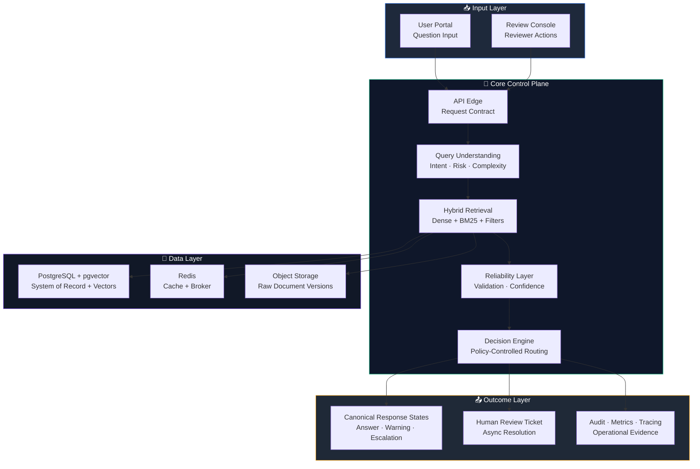

<div align="center">

# 🛡️ TrustOps RAG

### Build a risk-aware enterprise RAG platform that answers with evidence, escalates uncertainty, and fails safely

[](./ROADMAP.md)
[](https://www.python.org/)
[](https://fastapi.tiangolo.com/)
[](https://www.postgresql.org/)
[](https://redis.io/)
[](https://python-poetry.org/)

*Designed around hybrid retrieval, policy-controlled decisioning, human review, and audit-grade observability.*

</div>

---

## 💡 Value Proposition

In enterprise knowledge systems, the expensive failure is not a missing answer. It is the unsupported answer that looks confident, travels quickly, and becomes operational truth.

**TrustOps RAG** is being built to change that operating model:

| Without This System | With TrustOps RAG |
|---|---|
| Generic chat behavior returns plausible but weakly supported answers | Automatic answers are expected to include citations, or the request is escalated safely |
| High-risk requests rely on ad hoc reviewer judgment | High-risk flows are designed around stricter thresholds, policy control, and human review |
| Document drift creates silent policy mistakes | Active document versions and `policy_version` are part of the control plane |
| Cost, latency, and decision logic are hard to explain after the fact | `decision_reason`, `system_state`, cost, and latency are part of the contract |
| Failure handling is inconsistent across teams | `answered`, `answered_with_warning`, `human_review_required`, `blocked`, and `failed_safe` are first-class outcomes |

**Bottom line:** the platform is being designed around **0% unsupported automatic answers** on the release-gate dataset and **100% audit completeness** as operating constraints, not marketing claims.

---

## 📊 Business Metrics (Built-In)

The platform is being designed so value and risk can be measured directly in the runtime path and evaluation pipeline.

| Metric | Formula | Example |
|---|---|---|
| **Review Deflection Rate** | `(total_queries - human_review_queries) / total_queries` | `700 / 1000 =` **70%** |
| **Unsupported Auto-Answer Rate** | `unsupported_auto_answers / automatic_answers` | release-gate target **0%** |
| **Audit Completeness** | `auditable_requests / total_requests` | target **100%** |
| **Average Cost per Query** | `total_model_cost_usd / total_queries` | `3.80 / 1000 =` **$0.0038** |
| **Correct Escalation Rate** | `correct_escalations / total_escalations` | target **>= 95%** |

> Metric values depend on dataset quality, provider mix, routing rules, cache behavior, and the active policy version.

---

## 🏗️ Architecture



This repository is currently in the foundation stage: the architecture, contracts, execution plan, package layout, and dependency graph are in place, and the runtime is being built incrementally by module.

---

## 🛠️ Tech Stack & Why

| Technology | Version | Why This Choice |
|---|---|---|
| **Python** | `3.11+` | Strong fit for service code, retrieval tooling, evaluation workflows, and typed backend development |
| **FastAPI** | `0.136+` | Contract-first API development with strong typing, async support, and OpenAPI generation |
| **PostgreSQL** | `16+` | Transactional source of truth for documents, queries, decisions, and audit metadata |
| **pgvector** | `0.4+` | Keeps dense retrieval close to document metadata and version control without introducing a second data platform too early |
| **Redis** | `7+` | Supports semantic cache, lightweight async coordination, and fast operational primitives |
| **Celery** | `5.6+` | Baseline worker model for ingestion, review workflows, and scheduled tasks |
| **sentence-transformers** | `5.4+` | Local embedding and reranking path for reproducible benchmarking and modular model adapters |
| **OpenTelemetry** | `1.41+` | Vendor-neutral tracing model for latency decomposition across API, persistence, and workers |
| **Prometheus + Grafana** | `selected` | Fits service-level metrics, SLO tracking, and release-gate observability without vendor lock-in |
| **Poetry** | `2.2+` | Reproducible dependency management with lockfile control and clean local onboarding |

---

## ⚡ Quick Start

### Prerequisites

- Python `3.11+`
- Poetry `2.2+`
- Git
- Docker Desktop if you want to prepare for later infrastructure slices

### 1. Clone & Install

```bash
git clone <your-repo-url>
cd trustops_rag
poetry install
```

### 2. Validate the Workspace

```bash
poetry check
poetry run python -c "import trustops_rag; print('workspace-ok')"
```

### 3. Read the Core Project Contracts

```bash
ls *.md
```

Use this reading order:

1. `SPEC.md`
2. `ARCHITECTURE.md`
3. `ROADMAP.md`
4. `IMPLEMENTATION_PLAN.md`
5. `STACK.md`

### 4. Understand the Current Repository State

| Area | Current State | Purpose |
|---|---|---|
| **Documentation** | Established | Defines architecture, product contract, stack, roadmap, and execution model |
| **Python package** | Bootstrapped | Installable base package for incremental backend slices |
| **Infrastructure layout** | Structured | Reserved for local orchestration and observability assets |
| **Runtime services** | Not implemented yet | Will be added phase by phase, not as one final script |

---

## 📁 Project Structure

```txt
trustops-rag/
├── README.md                    # 📘 Project entry point and positioning
├── SPEC.md                      # 📜 Product contract, states, and business rules
├── ARCHITECTURE.md              # 🏗️ Runtime architecture and operating model
├── ROADMAP.md                   # 🧭 Strategic milestones and rollout path
├── IMPLEMENTATION_PLAN.md       # ✅ Technical backlog, DoD, and commit order
├── STACK.md                     # 🛠️ Technology decisions and engineering guardrails
├── pyproject.toml               # ⚙️ Poetry project definition and dependencies
├── poetry.lock                  # 🔒 Locked dependency graph for reproducibility
├── docs/                        # 📚 Supporting documentation and ADR space
│   └── adr/                     #   Architecture Decision Records
│
├── src/                         # 🧠 Python application package root
│   └── trustops_rag/
│       ├── api/                 #   API edge, schemas, and request wiring
│       ├── application/         #   Use-case orchestration and service flows
│       ├── domain/              #   Entities, rules, and core business logic
│       ├── infrastructure/      #   Database, providers, and external adapters
│       ├── workers/             #   Async pipelines and background processing
│       └── evals/               #   Benchmark and evaluation runners
│
├── frontend/                    # 🌐 User-facing surfaces
│   ├── user-portal/             #   End-user question experience
│   └── review-console/          #   Reviewer workflow interface
│
├── tests/                       # 🧪 Verification by testing scope
│   ├── unit/                    #   Isolated logic tests
│   ├── integration/             #   Cross-module behavior tests
│   ├── contract/                #   API contract validation
│   ├── security/                #   Security control verification
│   └── evaluation/              #   Release-gate and benchmark checks
│
└── infra/                       # 🚢 Deployment and observability assets
    ├── docker/                  #   Image definitions and runtime packaging
    ├── compose/                 #   Local orchestration files
    └── observability/           #   Metrics, tracing, and dashboard assets
```

---

## 🔒 Security

- **Fail-safe outcomes** — the product contract already reserves `blocked`, `human_review_required`, and `failed_safe` as explicit runtime states rather than hidden fallback behavior.
- **Policy traceability** — `policy_version`, `decision_reason`, and `system_state` are part of the response model so behavior changes remain explainable over time.
- **Tenant-aware enforcement** — the architecture reserves document-level ACL filtering before reranking and citation selection, not after response generation.
- **Secrets isolation** — runtime secrets are intended to come from environment configuration or managed secret stores, not from committed repository files.
- **Audit-first operation** — requests, answers, escalations, and reviewer actions are designed to produce durable audit evidence across API and worker flows.

---

## 🧪 Testing & Validation

The automated test suite is not being advertised as complete yet. The current repository cut validates environment integrity and package bootstrap while the first runtime slices are being implemented.

```bash
poetry check
poetry run python -c "import trustops_rag; print('workspace-ok')"

# Current validation scope: dependency resolution, package install, and import smoke check
```

As the platform moves through the first implementation phases, this section should expand into:

- unit tests for core domain logic
- integration tests for ingestion, retrieval, and decisioning
- contract tests for `/ask`
- security tests for blocked and denied flows
- evaluation gates for release readiness

---

<div align="center">

**TrustOps RAG is being built to make enterprise RAG auditable, risk-aware, and operationally defensible from day one.**

[Specification](./SPEC.md) · [Architecture](./ARCHITECTURE.md) · [Roadmap](./ROADMAP.md) · [Implementation Plan](./IMPLEMENTATION_PLAN.md) · [Stack](./STACK.md)

</div>
